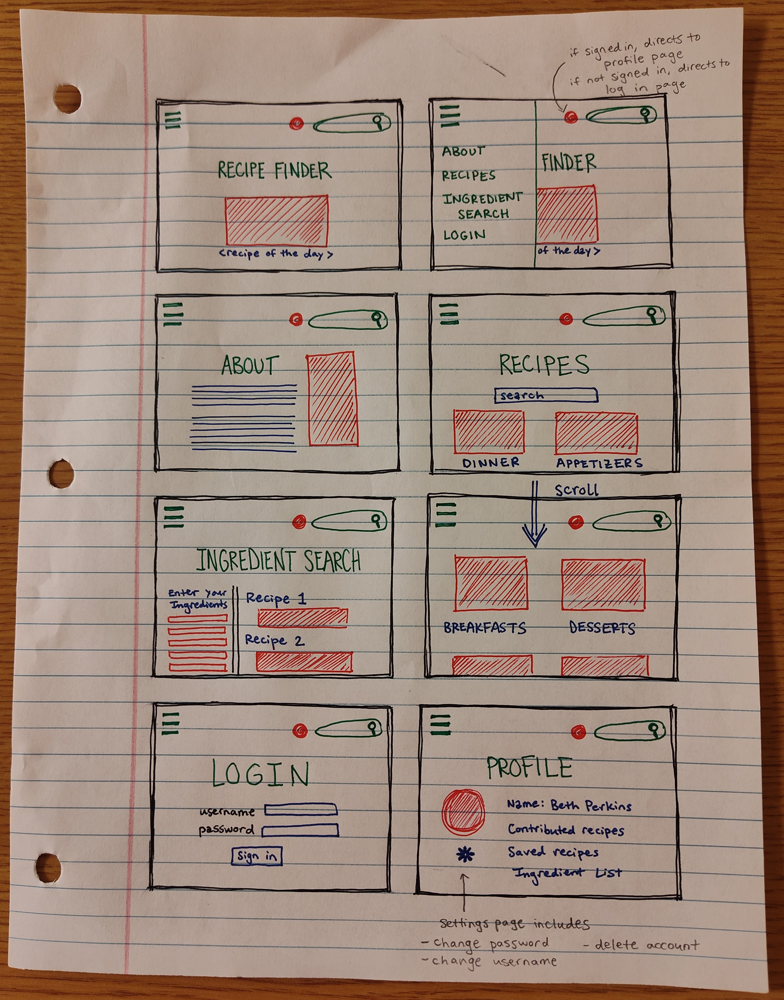
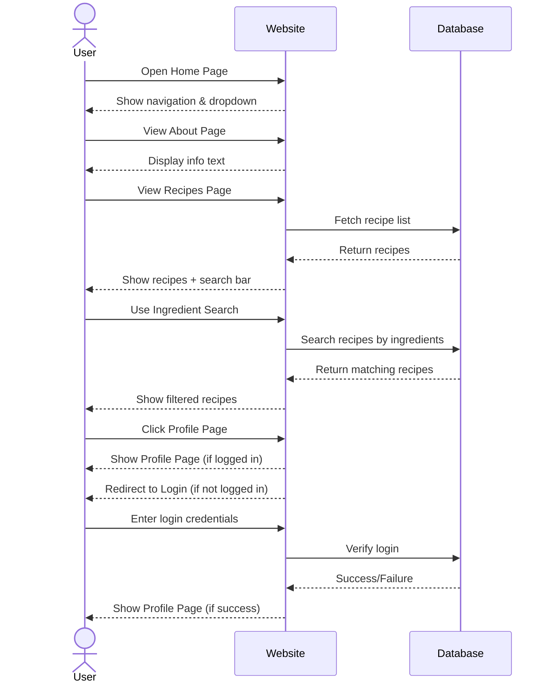
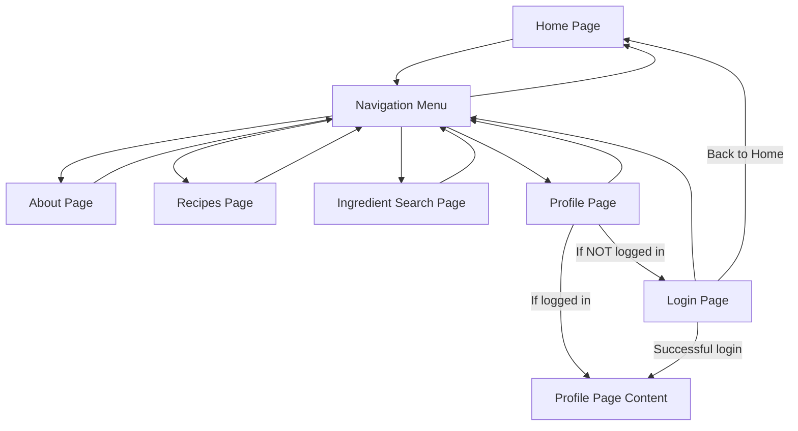

# Recipe Finder

[My Notes](notes.md)

Recipe Finder is an application that lets users browse recipes as well as add their own. But beyond being a simple recipe database, the user can enter what ingredients they currently have in their house and the Recipe Finder will spit out recipes that contain only those ingredients. Users can create an account, save recipes, create recipes, and record what ingredients they have. Some ingredients, like spices, cans or other dry goods, will be in a section that is more permanant so that the user doesn't have to input them every time, but will frequently ask for updates regarding ingredients such as fresh fruits and vegetables. After making the recipe the user can mark the recipe as made and the website will prompt the user to remove used ingredients.

#### Other Possible Website Names
 - The Partial Pantry

## 🚀 Specification Deliverable

For this deliverable I did the following. I checked the box `[x]` and added a description for things I completed.

- [x] Proper use of Markdown
- [x] A concise and compelling elevator pitch
- [x] Description of key features
- [x] Description of how you will use each technology
- [x] One or more rough sketches of your application. Images must be embedded in this file using Markdown image references.

### Elevator pitch

Have you ever stared at your fridge full of food and still thought, 'What's for dinner?' You come up with an idea, only to realize you're missing a key ingredient. That's where Recipe Finder comes in. Simply enter the ingredients you already have, and we'll instantly suggest recipes you can make right now—no last-minute grocery runs and no dinner stress. Recipe Finder has got your back!

### Design

```mermaid
sequenceDiagram
    actor User as User
    participant Website as Website
    participant Database as Database

    %% Browsing without login
    User->>Website: Open Home Page
    Website-->>User: Show navigation & dropdown

    User->>Website: View About Page
    Website-->>User: Display info text

    User->>Website: View Recipes Page
    Website->>Database: Fetch recipe list
    Database-->>Website: Return recipes
    Website-->>User: Show recipes + search bar

    User->>Website: Use Ingredient Search
    Website->>Database: Search recipes by ingredients
    Database-->>Website: Return matching recipes
    Website-->>User: Show filtered recipes

    %% Profile requires login
    User->>Website: Click Profile Page
    Website-->>User: Show Profile Page (if logged in)
    Website-->>User: Redirect to Login (if not logged in)

    User->>Website: Enter login credentials
    Website->>Database: Verify login
    Database-->>Website: Success/Failure
    Website-->>User: Show Profile Page (if success)

```

```mermaid
flowchart TD
    %% Main pages
    A[Home Page]
    B[About Page]
    C[Recipes Page]
    D[Ingredient Search Page]
    E[Profile Page]
    F[Login Page]

    %% Dropdown menu
    M[Navigation Menu]

    %% Navigation menu links
    M --> A
    M --> B
    M --> C
    M --> D
    M --> E

    %% Page connections
    A --> M
    B --> M
    C --> M
    D --> M
    E --> M
    F --> M

    %% Profile login logic
    E -->|If logged in| G[Profile Page Content]
    E -->|If NOT logged in| F[Login Page]
    F -->|Successful login| G
    F -->|Back to Home| A
```

### Key features

- Secure login
- Side panel pull out with links to pages
- Recipe page that the user can browse or use a search by name
- Ingredient search page that pulls recipes based on their ingredients
- Users can save recipes
- Users can create new recipes

### Technologies

I am going to use the required technologies in the following ways.

- **HTML** - Uses correct HTML structure for application. Multiple HTML pages. Hyperlinks to choice artifact.
- **CSS** - Application styling that looks good on different screen sizes, uses good whitespace, color choice and contrast.
- **React** -  Provides login, recipe displays, and use of React for routing and components.
- **Service** - Backend service with endpoints for:
  - login
  - retrieving recipes
  - creating recipes
  - adding ingredients to pantry
  - will use the Spoonacular Food API to retrieve recipe information and search for recipes based on ingredients. When a user enters the ingredients they have available, the backend will send a request to Spoonacular and use the returned recipes to find recipes that can be made with those ingredients. Recipe information such as the recipe name, ingredients, instructions, and images can then be displayed in the application. This will allow Recipe Finder to use a real external recipe database rather than relying entirely on recipes stored in its own database.
- **DB/Login** - Store users, recipes, and user ingredients in database. Register and login users. Credentials securely stored in database.
- **WebSocket** - Recipes are displayed on the website, including a recipe of the day on the home page.

## 🚀 AWS deliverable

For this deliverable I did the following. I checked the box `[x]` and added a description for things I completed.

- [x] **Server deployed and accessible with custom domain name** - [My server link](https://thepartialpantry.click).

## 🚀 HTML deliverable

For this deliverable I did the following. I checked the box `[x]` and added a description for things I completed.

- [x] **HTML pages** - Created the home, about, recipes, ingredients, login, and user home pages for the application.
- [x] **Proper HTML element usage** - Each page includes valid document structure and uses elements like BODY, HEADER, NAV, MAIN, and FOOTER.
- [x] **Links** - Added navigation links between pages so users can move through the app.
- [x] **Text** - Added application text and content to each page.
- [x] **3rd party API placeholder** - Added a Recipe of the Day section on the Home page identifying the future Spoonacular API integration.
- [x] **Images** - Added placeholder image content to the site.
- [x] **Login placeholder** - Added a login page and a user-home flow for the login placeholder experience.
- [x] **DB data placeholder** - Added sample pantry records with food, quantity, and last-updated fields. These represent data that will eventually be loaded from the database.
- [x] **WebSocket placeholder** - Added a live vote updates section on the recipe page that will eventually display real-time WebSocket updates.

## 🚀 CSS deliverable

For this deliverable I did the following. I checked the box `[x]` and added a description for things I completed.

- [ ] **Header, footer, and main content body** - I did not complete this part of the deliverable.
- [ ] **Navigation elements** - I did not complete this part of the deliverable.
- [ ] **Responsive to window resizing** - I did not complete this part of the deliverable.
- [ ] **Application elements** - I did not complete this part of the deliverable.
- [ ] **Application text content** - I did not complete this part of the deliverable.
- [ ] **Application images** - I did not complete this part of the deliverable.

## 🚀 React part 1: Routing deliverable

For this deliverable I did the following. I checked the box `[x]` and added a description for things I completed.

- [ ] **Bundled using Vite** - I did not complete this part of the deliverable.
- [ ] **Components** - I did not complete this part of the deliverable.
- [ ] **Router** - I did not complete this part of the deliverable.

## 🚀 React part 2: Reactivity deliverable

For this deliverable I did the following. I checked the box `[x]` and added a description for things I completed.

- [ ] **All functionality implemented or mocked out** - I did not complete this part of the deliverable.
- [ ] **Hooks** - I did not complete this part of the deliverable.

## 🚀 Service deliverable

For this deliverable I did the following. I checked the box `[x]` and added a description for things I completed.

- [ ] **Node.js/Express HTTP service** - I did not complete this part of the deliverable.
- [ ] **Static middleware for frontend** - I did not complete this part of the deliverable.
- [ ] **Calls to third party endpoints** - I did not complete this part of the deliverable.
- [ ] **Backend service endpoints** - I did not complete this part of the deliverable.
- [ ] **Frontend calls service endpoints** - I did not complete this part of the deliverable.
- [ ] **Supports registration, login, logout, and restricted endpoint** - I did not complete this part of the deliverable.

## 🚀 DB deliverable

For this deliverable I did the following. I checked the box `[x]` and added a description for things I completed.

- [ ] **Stores data in MongoDB** - I did not complete this part of the deliverable.
- [ ] **Stores credentials in MongoDB** - I did not complete this part of the deliverable.

## 🚀 WebSocket deliverable

For this deliverable I did the following. I checked the box `[x]` and added a description for things I completed.

- [ ] **Backend listens for WebSocket connection** - I did not complete this part of the deliverable.
- [ ] **Frontend makes WebSocket connection** - I did not complete this part of the deliverable.
- [ ] **Data sent over WebSocket connection** - I did not complete this part of the deliverable.
- [ ] **WebSocket data displayed** - I did not complete this part of the deliverable.
- [ ] **Application is fully functional** - I did not complete this part of the deliverable.
